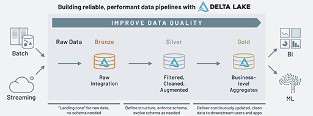

## **Arquitetura medalhão**(multi-hop) by Databricks:

Define camadas, separadas pelo nível de acurácia dos dados, para a construção de pipelines de dados. 
Existe algumas variações dos escopos da camada, mas para o Databricks são:
* **Bronze:** Dados brutos (**_raw_**) e históricos;
* **Prata:** Dados filtrados, limpos e aumentados. Tipicamente eliminando dados duplicados, preservando granularidade (sem agregação), com verificação de qualidade;
* **Ouro:** Agregações à nível de negócio.

**Imagem 01 - O que é a arquitetura medalhão:**

Fonte: <https://www.databricks.com/br/glossary/medallion-architecture>